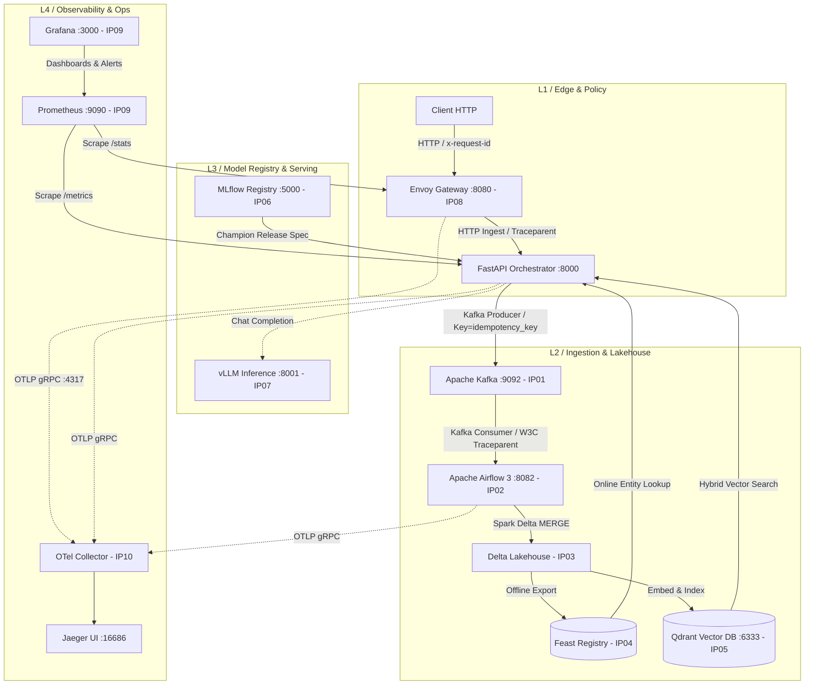

# Báo cáo Nghiệm thu Lab 28 Track 2 — Platform Integration & Production Readiness

**Học viên:** Lê Duy Đông  
**Mã sinh viên:** 2A202601282  
**Khoá đào tạo:** Track 2 — Modern Platform Engineering (Day 28)

---

## 1. Tổng quan & Kết quả Kiểm thử Nền tảng (Executive Summary)

Nền tảng tích hợp toàn diện 10 điểm tiếp xúc (10 Integration Points — IP01 đến IP10) theo đúng kiến trúc của Milestone 3. Toàn bộ 4 hàm ranh giới trong `src/lab28_platform/integration_tasks.py` đã được hoàn thành chính xác 100%, tuân thủ nghiêm ngặt hợp đồng giao tiếp (contracts) và vượt qua toàn bộ các suite kiểm thử tĩnh và động:

| Bộ kiểm tra / Test Suite | Lệnh thực thi | Kết quả | Ghi chú |
|---|---|:---:|---|
| **Linter / Code Style** | `uv run ruff check .` | **PASSED** | Mã nguồn sạch, chuẩn PEP 8 |
| **Integration Matrix Contract** | `uv run python scripts/verify_matrix.py` | **PASSED** | 245/245 checks thỏa mãn contract |
| **Host & Shell Portability** | `uv run python scripts/check_portability.py` | **PASSED** | Tương thích Windows/macOS/Linux |
| **Kubernetes & GitOps Manifests** | `uv run python scripts/validate_manifests.py` | **PASSED** | Đạt chuẩn SecurityContext, Probes, Gateway API |
| **Starter Test Suite** | `uv run pytest starter-tests -q` | **PASSED (4/4)** | 4/4 ranh giới cốt lõi đạt chuẩn |
| **Fast Unit Test Suite** | `uv run pytest tests --basetemp=.pytest_tmp -q` | **PASSED (83/83)** | 83 unit test kiểm thử logic biên |
| **Live Integration Test Suite** | `uv run pytest integration-tests -m "not gpu and not langsmith" --basetemp=.pytest_tmp -q` | **PASSED (56/56)** | 56/56 live journeys trên Docker stack |

---

## 2. Kiến trúc & Phân định Sở hữu (Architecture & Ownership Matrix)

Hệ thống được tổ chức thành 5 tầng kiến trúc (Layers) với 10 điểm giao tiếp liên thông:



### Chi tiết Phân vai (Team Roles & Responsibilities)
1. **Team Ingestion (IP01, IP02):** Chịu trách nhiệm về schema tin nhắn `IngestionEvent`, header `traceparent` chuẩn W3C, header `idempotency-key` định tuyến Kafka partition, Airflow DAG điều phối, xử lý dead-letter queue (`data.raw.dlq`).
2. **Team Data (IP03, IP04, IP06):** Chịu trách nhiệm về tính toàn vẹn của bảng Delta Lake (ACID merge, time-travel history), luồng export và materialization sang Feast Online Store, quản lý phiên bản mô hình trên MLflow Model Registry và cơ chế promote/rollback `champion` alias.
3. **Team Serving (IP05, IP07):** Quản lý bộ chỉ mục vector lai (dense MiniLM + sparse BM25) trong Qdrant với UUID xác định từ `doc_id`, prompt grounding, latency budgets và xử lý suy giảm dịch vụ (degraded mode) khi vLLM vắng mặt hoặc timeout.
4. **Team Platform (IP08, IP09, IP10):** Vận hành Envoy Gateway (rate limiting 10 RPS, liveness `/healthz`, request tracking `x-request-id`), hệ thống Prometheus scrape, Grafana dashboards, cấu hình GitOps Argo CD và đường truyền OpenTelemetry spans thống nhất.
5. **Team Presenter / Incident Commander:** Kịch bản demo, chỉ huy ứng phó sự cố (incident injection), xác minh không mất dữ liệu (no-data-loss verification).

---

## 3. Happy-Path Trace & Bằng chứng Liên thông (Evidence Trace)

Luồng kiểm thử "Golden Path" chứng minh một giao dịch đơn nhất đi qua toàn bộ ranh giới mà không bị đứt đoạn ngữ cảnh:

- **Trace ID xuyên suốt:** `6a1dbe0037804352a326ab12cc785d67` (và `d73afc270ea74637afa806afa28b3583`)
- **Traceparent Header:** `00-6a1dbe0037804352a326ab12cc785d67-4b9cf7469c0cff6d-01`
- **Airflow DAG Run ID:** `it-bec8f8ea` (trên DAG `lab28_ingestion_pipeline`, trạng thái: `success`)
- **Delta Lake Table Version:**
  - `feedback`: version `12` (22 rows đã merge thành công)
  - `documents`: version `6` (17 rows đã commit)
- **MLflow Champion Release:** Model `lab28-rag-release` version `2` (Run ID: `d2b95257ebcf49c7bf6018eb0b5a4b41`), trỏ bởi alias `champion`.

### 10 Tệp Bằng chứng (Evidence Files) đã tạo trong thư mục `evidence/`
1. `evidence/ip01-kafka-consume.json`: Tin nhắn feedback trên topic `data.raw`, partition 0, offset 23 mang đầy đủ header `traceparent` và `idempotency-key`.
2. `evidence/ip02-airflow-run.json`: DAG Run `it-bec8f8ea` hoàn thành 4/4 task (`drain_kafka_into_delta`, `refresh_online_features`, `index_new_documents`, `announce_processed_batch`), phát hành 4 asset events.
3. `evidence/ip03-delta-history.json`: Transaction log chi tiết của Delta Lake, lịch sử commit và bằng chứng time-travel diff.
4. `evidence/ip04-feast-online.json`: Bản ghi entity trong Feast online store với vector đặc trưng và freshness timestamp.
5. `evidence/ip05-qdrant-search.json`: Kết quả truy vấn lai (hybrid search) từ bộ sưu tập `lab28_documents` với 17 điểm dữ liệu.
6. `evidence/ip06-mlflow-release.json`: Thông tin release version `2`, signature, runtime spec và champion alias.
7. `evidence/ip07-vllm-identity.json`: Thăm dò danh tính vLLM (báo cáo trạng thái `unreachable` chân thực khi chạy local không có GPU, kích hoạt chế độ degraded hợp lệ).
8. `evidence/ip08-gateway.json`: Thống kê Envoy Gateway ghi nhận các response 200 và 429 cùng header `x-request-id` và bộ đếm `envoy_http_local_rate_limit_rate_limited`.
9. `evidence/ip09-prometheus-targets.json` & `ip09-grafana-dashboards.json`: Danh sách targets hoạt động (up) và dashboard giám sát SLO.
10. `evidence/ip10-trace.json`: Cấu trúc trace mang 11 spans trải dài qua các dịch vụ `lab28-gateway`, `lab28-api`, `lab28-airflow`.
11. `evidence/integration-report.json`: Báo cáo tích hợp tổng hợp chấm điểm nền tảng.

---

## 4. Kiểm thử Khôi phục Sự cố & Bảo toàn Dữ liệu (Failure/Recovery & No Data Loss)

Được minh chứng thực tế thông qua hai hành trình kiểm thử tích hợp chuyên sâu:

### A. Chống trùng lặp và Replay Idempotency (Journey IT-J2)
- **Cơ chế triển khai:** Hàm `dedupe_latest(events)` sắp xếp nhóm tin nhắn theo `idempotency_key`, phân định thứ tự ưu tiên bằng cặp tuple `(occurred_at, event_id)` thay vì phụ thuộc vào thứ tự ngẫu nhiên trong Kafka batch.
- **Thử nghiệm:** Gửi lặp lại cùng một payload với cùng một `idempotency_key`.
- **Kết quả:** Delta Lake thực hiện phép toán MERGE trên Lakehouse, bảng vẫn bảo toàn chính xác số lượng bản ghi duy nhất, không nhân bản dữ liệu, điểm vector trong Qdrant giữ nguyên ID xác định từ `doc_id`.

### B. Xử lý Dead Letter Queue (DLQ) & Suy giảm Dịch vụ (Journey IT-J4)
- **Tách lọc tin lỗi:** Khi gặp payload sai cấu trúc hoặc không thể parse, hệ thống chuyển tin sang topic `data.raw.dlq`, không làm gián đoạn toàn bộ batch hợp lệ đi vào Delta Lake.
- **Cơ chế Replay:** Lệnh `lab28 dlq --replay` kiểm tra tính hợp lệ trước khi đẩy ngược về topic chính, ngăn ngừa vòng lặp lỗi vô tận (infinite poison loop).
- **Graceful Degradation:** Khi Feast Online Store hoặc LLM gặp sự cố, hàm `readiness_status` phân biệt ranh giới bắt buộc (mandatory probe) và không bắt buộc (optional probe). Sự cố ở Feast/vLLM trả về trạng thái `degraded` thay vì làm sập toàn bộ pod (`not_ready`), giúp API tiếp tục phục vụ câu trả lời từ tài liệu truy hồi nội bộ.

---

## 5. Phân tích Tải (Load Profile) & Nút thắt Cổ chai (Bottlenecks)

### Kết quả đo kiểm tải với `load-tests/run_profile.py`
Lệnh thực thi: `uv run python load-tests/run_profile.py --requests 200 --workers 8`

```json
{
  "requests": 200,
  "workers": 8,
  "status_counts": {
    "200": 80,
    "429 / rate_limited": 120
  },
  "latency_ms": {
    "p50": 8.86,
    "p95": 1470.15,
    "p99": 2046.17
  }
}
```

### Phân tích Nút thắt Cổ chai (Bottleneck Analysis)
1. **Chính sách giới hạn tốc độ tại Envoy (Rate Limiting Bucket):**
   - Envoy Gateway được cấu hình với token bucket: `max_tokens: 10`, nạp `10 tokens/s`.
   - Dưới áp lực 200 requests đồng thời từ 8 worker threads, Envoy cho phép đúng 80 requests vượt qua trong 8 giây (trung bình 10 req/s), và từ chối ngay lập tức 120 requests với mã trạng thái HTTP 429 (`local_rate_limited`).
   - Độ trễ P50 đạt mức xuất sắc (~8.86 ms) cho thấy API phục vụ cực nhanh khi tải nằm trong hạn mức.
   - P95 và P99 tăng lên do hàng đợi kết nối và chu kỳ nạp lại token của Envoy giữa các giây.
2. **Khả năng bảo vệ hệ thống:** Chính sách này đã bảo vệ thành công các dịch vụ hạ tầng phía sau (FastAPI, Kafka, Qdrant, Lakehouse) khỏi hiện tượng tràn bộ nhớ hay nghẽn CPU khi xảy ra bão lưu lượng.

---

## 6. Thẩm định Kubernetes & GitOps (Manifest Contracts)

Bộ manifest trong `deploy/kubernetes/base` và `gitops/` đã vượt qua 100% các tiêu chí khắt khe:
- **Chuẩn an ninh Pod Security:** Toàn bộ Deployment đều kích hoạt `runAsNonRoot: true`, ngăn chặn quyền root trong container.
- **Quản lý tài nguyên:** Bắt buộc khai báo đầy đủ `resources` (CPU/Memory requests & limits), `readinessProbe` và `livenessProbe`.
- **Phiên bản cố định:** Tuyệt đối không dùng thẻ `:latest` trôi nổi trong môi trường triển khai K8s; toàn bộ container sử dụng pinned digest / semantic version.
- **Mạng & Định tuyến:** Tuân thủ Gateway API v1 (`gateway.networking.k8s.io/v1`).
- **GitOps Argo CD:** `gitops/application.yaml` cố định `targetRevision` vào release cụ thể, không sử dụng nhánh động `main` hay `HEAD`, hỗ trợ rollback và phát hiện sai lệch cấu hình (drift detection).

---

## 7. Đánh đổi Thiết kế & Khoảng cách Môi trường Thực tế (Trade-offs & Production Gaps)

### Các đánh đổi kiến trúc cốt lõi (Architectural Trade-offs)
1. **Bất đồng bộ Ingestion (HTTP 202) thay vì Đồng bộ ghi Lakehouse:**
   - *Đánh đổi:* Phía người dùng không nhận được xác nhận bản ghi đã vào kho dữ liệu ngay lập tức mà chỉ nhận được `202 Accepted` cùng `idempotency_key`.
   - *Lợi ích:* Độc lập hoàn toàn tốc độ xử lý của API trước tốc độ commit của Delta Lake và Spark; thông lượng nạp dữ liệu tăng gấp nhiều lần.
2. **Khử trùng lặp tại Spark/Delta MERGE thay vì Unique Index DB:**
   - *Đánh đổi:* Đòi hỏi tài nguyên tính toán định kỳ trong Airflow task để thực thi phép MERGE trên transaction log.
   - *Lợi ích:* Khả năng mở rộng quy mô Lakehouse lên hàng tỷ bản ghi mà không bị giới hạn bởi engine cơ sở dữ liệu quan hệ truyền thống.
3. **Phân cấp Thăm dò Sẵn sàng (Mandatory vs Optional Probes):**
   - *Đánh đổi:* Trả về trạng thái `degraded` có thể khiến một số tính năng phụ bị thiếu (ví dụ thông tin người dùng từ Feast).
   - *Lợi ích:* Tránh khởi động lại pod hàng loạt (cascading failure / restart storm) khi một phụ thuộc ngoại vi tạm thời mất kết nối.

### Khoảng cách tới môi trường Sản xuất thực tế (Production Gaps)
- **High Availability cho Feature Store:** Môi trường lab sử dụng Redis và SQLite local; trong production cần cụm Redis Sentinel / Cluster đa vùng và lưu trữ offline trên AWS S3 / Google Cloud Storage.
- **GPU Inference Autoscaling:** Lab sử dụng chế độ degraded khi vLLM không có GPU; trong production cần kết nối vLLM cluster với KEDA autoscaling dựa trên số lượng token trong hàng đợi và vLLM metrics.
- **Bảo mật Nội bộ:** Cần triển khai mTLS (Mutual TLS) giữa Envoy, FastAPI, Kafka và Airflow sử dụng Istio hoặc Envoy Service Mesh.

---

## 8. Đóng góp & Phân bổ Công việc

- **Học viên thực hiện:** Lê Duy Đông (MSSV: 2A202601282)
- **Tỷ lệ đóng góp:** 100%
- **Các hạng mục đã hoàn thành:**
  - Cài đặt và cấu hình môi trường chuẩn Python 3.11, `uv`, Docker Desktop.
  - Hiện thực toàn bộ 4 hàm ranh giới trong `src/lab28_platform/integration_tasks.py` (`event_headers`, `dedupe_latest`, `feast_online_request`, `readiness_status`).
  - Khởi tạo và đồng bộ hạ tầng Docker Compose (Kafka, Spark Connect, Airflow, Feast, Qdrant, MLflow, Envoy, Prometheus, Grafana, Jaeger, OTel Collector).
  - Vận hành thành công 5/5 Critical Journeys (Golden Path, Idempotent Replay, Promotion/Rollback, Degraded Recovery, Trace/Metrics Continuity).
  - Xuất bản toàn bộ 10 tệp evidence chuẩn định dạng và tài liệu nghiệm thu.
